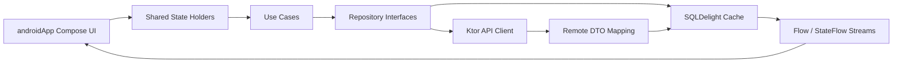

# kmp-fintech-starter


 

Production-ready Kotlin Multiplatform architecture for fintech Android apps.

This starter focuses on the patterns teams actually need in production: offline-first data flows, strict shared-domain boundaries, Koin-powered dependency injection, SQLDelight as the source of truth, and a Compose-first Android UI that stays thin over shared business logic.

## Motivation

Fintech apps have very little tolerance for inconsistent state, blank screens after failed syncs, or platform-specific logic leakage. This starter demonstrates a KMP setup where:

- shared code owns business rules, repositories, sync orchestration, and state holders
- Android stays focused on rendering, navigation, and platform bootstrapping
- SQLDelight remains the single source of truth for all transaction and account reads
- network failures degrade gracefully to cached data instead of collapsing the UI
- convention plugins and a strict version catalog keep the build scalable from day one

## Architecture



### Offline-first sync pattern

1. The UI observes only SQLDelight-backed `Flow` streams from repositories.
2. A refresh triggers a use case, not a direct network call from the screen.
3. The repository fetches from Ktor, maps DTOs to local entities, and writes into SQLDelight.
4. SQLDelight invalidates queries and emits updated rows through Flow.
5. If the network fails, existing cached rows continue rendering and the UI can show an error state without losing data.

That means no blank screen after a bad refresh and no transport-layer details leaking into presentation.

## Module structure

```text
kmp-fintech-starter/
├── androidApp/      # Android-only Compose UI, navigation, resources, app bootstrap
├── build-logic/     # Convention plugins for KMP libraries and Android apps
├── gradle/          # Centralized version catalog
├── iosApp/          # SwiftUI sample entry point consuming the shared module
├── shared/          # Shared KMP business logic, repositories, SQLDelight, Koin, state holders
└── .github/         # Android and iOS CI workflows
```

### What each module owns

- `shared`: domain models, repository contracts, Ktor client setup, SQLDelight schema, repository implementations, use cases, Koin shared modules, and platform-agnostic state holders.
- `androidApp`: Material 3 UI, type-safe navigation, pull-to-refresh UX, dynamic color theming, string resources, and Android-specific startup.
- `build-logic`: convention plugins that standardize compile SDK, target SDK, min SDK, Kotlin/Java toolchains, Compose, and KMP defaults.
- `iosApp`: a lightweight SwiftUI sample that initializes Koin and demonstrates where shared flows would be consumed in a real iOS shell.

## Tech stack

| Area | Library | Version |
| --- | --- | --- |
| Kotlin | Kotlin | 2.0.21 |
| KMP | Kotlin Multiplatform Gradle Plugin | 2.0.21 |
| UI | Compose Multiplatform | 1.7.3 |
| Networking | Ktor | 3.0.3 |
| Local database | SQLDelight | 2.0.2 |
| DI | Koin | 4.0.0 |
| Serialization | kotlinx.serialization | 1.7.3 |
| Concurrency | kotlinx.coroutines | 1.9.0 |
| Preferences | DataStore | 1.1.1 |
| Flow testing | Turbine | 1.2.0 |
| Assertions | Kotest | 5.9.1 |
| Android | minSdk / targetSdk / compileSdk | 26 / 35 / 35 |

## Setup

### Prerequisites

- Android Studio Hedgehog or newer
- JDK 17
- Xcode 15+ if you want to build the iOS sample integration

### Run locally

```bash
git clone https://github.com/rudradave1/kmp-fintech-starter.git
cd kmp-fintech-starter
./gradlew :shared:testDebugUnitTest
./gradlew :androidApp:assembleDebug
```

Then open the project in Android Studio and run the `androidApp` configuration on an emulator or device.

## Screenshots

Add your own screenshots here once you brand or extend the starter:

- `docs/screenshots/dashboard.png`
- `docs/screenshots/transactions.png`
- `docs/screenshots/transaction-detail.png`

## Fintech domain included

This starter ships with a realistic transaction-focused domain model:

- `Transaction`
- `Account`
- `DashboardState`
- category and status enums suited to consumer-fintech transaction feeds

The shared module also includes:

- transaction list filtering by category
- transaction detail lookup from local cache
- dashboard aggregation over account plus recent transactions
- sync metadata persistence for last successful refresh tracking

## Build conventions

### Version catalog only

All dependency and plugin versions are centralized in `gradle/libs.versions.toml`. Module scripts stay declarative and version drift stays contained.

### Convention plugins

`build-logic` packages reusable Gradle defaults so new modules can follow the same standards without copy-paste configuration.

### Shared DI graph

Koin modules are split into:

- `networkModule`
- `databaseModule`
- `repositoryModule`
- `useCaseModule`
- `viewModelModule`
- Android-only `androidModule`

## Testing strategy

Shared tests live in `shared/src/commonTest` and use manual fakes rather than Mockito to keep the suite multiplatform-friendly.

Covered examples include:

- `GetTransactionsUseCaseTest`
- `SyncTransactionsUseCaseTest`
- `FilterTransactionsByCategoryUseCaseTest`
- `TransactionViewModelTest`

## Using this as your own template

1. Fork or clone the repository.
2. Rename the package, application ID, and bundle identifiers.
3. Replace the demo endpoints in the shared Ktor service with your real backend.
4. Expand the SQLDelight schema with your fintech entities such as cards, statements, beneficiaries, and limits.
5. Add additional platform modules for analytics, secure storage, feature flags, and observability.
6. Swap the sample SwiftUI shell for your production iOS app target if you are shipping iOS.

## Contributing

Contributions are welcome.

1. Open an issue describing the feature, bug, or improvement.
2. Keep shared-domain changes platform-agnostic and preserve offline-first behavior.
3. Add or update tests for business logic changes in `shared/src/commonTest`.
4. Run the Android and shared checks before opening a pull request.

## Repository identity

- Name: `kmp-fintech-starter`
- GitHub: `github.com/rudradave1/kmp-fintech-starter`
- Tagline: Production-ready Kotlin Multiplatform architecture for fintech Android apps
- Author: Rudra Dave — Senior Android Engineer

## License

This project is licensed under the MIT License. See [LICENSE](./LICENSE).
